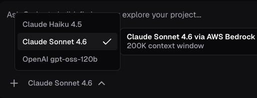

<span style="font-family:'Geist Mono',ui-monospace,Menlo,Consolas,monospace;font-size:12px;letter-spacing:0.04em;text-transform:uppercase;color:#A19CC8;">Coder Agents &middot; 02 — Pick an issue</span>

Now the agent does real work. You'll pick one of the seeded issues in your Gitea repository and ask the agent to implement it. This is the moment a workspace gets provisioned — but notice *why*: the agent decides it needs to read and edit code, so it selects an appropriate template and spins up compute scoped to *your* identity. No shared bot account, no standing workspace waiting around.

---

<h2 style="color: #7511E2; font-weight: 500;">Step 1: Start the application</h2>

Let's start the app in the workspace and preview.  First, start a new chat, select Sonnet 4.6, then provide the following prompt.

```text,copy
Clone the repo from [[ Instruqt-Var key="GITEA_REPO_URL" hostname="workshop" ]].git and run the application.
```

The workspace runs the memory-card app on a live Vite dev server. Open the **App Preview** tab to view the running app and play the game.

[button label="Open the App Preview"](tab-2)

---

<h2 style="color: #7511E2; font-weight: 500;">Step 2: Browse the issues</h2>

Open the **Gitea** tab — it lands on your repository's **Issues**, pre-loaded with five curated issues.

[button label="Open Issues in Gitea"](tab-1)

1. Click on any issue issue to open it.
2. Read its acceptance criteria so you can recognize a good result — you'll hand this exact issue to the agent next.

---

<h2 style="color: #7511E2; font-weight: 500;">Step 3: Ask the agent to start the work</h2>

Using the existing chat from the presvious challenge,  hand the agent the issue:

[button label="Open the Agents chat"](tab-0)

1. In the **Coder Agents** tab, click on the previous chat (top-left).
2. Prompt the agent to fix. a selected issue and send it.  Use the following prompt.

```copy
Implement the "Add a countdown timer" issue in the memory-card-ai-demo repository that is already cloned in your workspace: Create a feature branch, commit your change to it, and push the branch to the repository (origin).
```

The agent provisions a workspace scoped to *your* identity, works in the **pre-cloned repo**, and pushes a **feature branch** — all inside your sandbox's Gitea, never the public internet. Watch the chat narrate each step.

> [!TIP]
> You don't have to wait for the previous prompt to finish — queue a follow-up message while the agent works and it'll be picked up after the current step.

---

<h2 style="color: #7511E2; font-weight: 500;">Step 4: Confirm a branch exists</h2>

Switch back to the **Gitea** tab, then find the branch the agent just pushed:

[button label="Back to Gitea"](tab-1)

1. Click the **`< > Code`** tab (top-left of the repo).
2. Click the **branch count** near the top — it reads **"2 Branches"** once your branch is pushed — sitting next to **Commits** and **Tags**.
3. On the **Branches** page, your new feature branch (for example `coder/add-timer`) is listed under **Branches**, with a **New Pull Request** button beside it.

Once the branch is listed there, click **Check**.

> [!NOTE]
> If the agent is still working, wait until the branch appears in Gitea before clicking Check. The exact branch prefix varies; the check looks for a new branch named for the card-back work (e.g. contains `card-back` or `diamond`).

---

✅ The agent is on the job and a branch exists. Click **Check**, then continue to **Challenge 3** to watch it finish and open a pull request.
